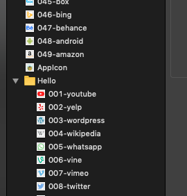

# AssetsMapper

[](https://badge.fury.io/rb/assets-mapper)

Add confidence for iOS assets reference using mapped assets.

## Installation

Add this line to your application's Gemfile:

```ruby
gem 'assets-mapper'
```

And then execute:

    $ bundle

Or install it yourself as:

    $ gem install assets-mapper

## Usage

Start by creating corresponding `.swift` file for each `.xcassets`. You can put it any where!

Example directory
```s
.
├── Assets.xcassets
├── Logos.xcassets
├── Scenes
│   ├── Utilities
│   │   ├── Assets.swift
│   │   └── Constants
│   └── ViewController.swift
└── Logos.swift
```

### Mapping Command

```s
assets-mapper [--ignore-folder] [--allow-modification]
```

#### Options
1. `--ignore-folder` Ignore .xcassets foldering.
2. `--allow-modification` Allow `assets-mapper` to modify name to a valid Swift variable. *Only perform in Swift variable name.*

**TAKE A LOOK?**



```swift
enum Example {
    static let k001youtube = "001-youtube"
    static let k002yelp = "002-yelp"
    static let k003wordpress = "003-wordpress"
    static let k004wikipedia = "004-wikipedia"
    static let k005whatsapp = "005-whatsapp"
    
    ...

    static let k040dribbble = "040-dribbble"
    static let k041deviantart = "041-deviantart"
    static let k042delicious = "042-delicious"
    static let k043creativemarket = "043-creative-market"
    static let k044buffer = "044-buffer"
    static let k045box = "045-box"
    static let k046bing = "046-bing"
    static let k047behance = "047-behance"
    static let k048android = "048-android"
    static let k049amazon = "049-amazon"
}
```

## Development

After checking out the repo, run `bin/setup` to install dependencies. Then, run `rake spec` to run the tests. You can also run `bin/console` for an interactive prompt that will allow you to experiment.

To install this gem onto your local machine, run `bundle exec rake install`. To release a new version, update the version number in `version.rb`, and then run `bundle exec rake release`, which will create a git tag for the version, push git commits and tags, and push the `.gem` file to [rubygems.org](https://rubygems.org).

## Contributing

Bug reports and pull requests are welcome on GitHub at https://github.com/[USERNAME]/assets_mapper. This project is intended to be a safe, welcoming space for collaboration, and contributors are expected to adhere to the [Contributor Covenant](http://contributor-covenant.org) code of conduct.

## License

The gem is available as open source under the terms of the [MIT License](https://opensource.org/licenses/MIT).

## Code of Conduct

Everyone interacting in the AssetsMapper project’s codebases, issue trackers, chat rooms and mailing lists is expected to follow the [code of conduct](https://github.com/[USERNAME]/assets_mapper/blob/master/CODE_OF_CONDUCT.md).
